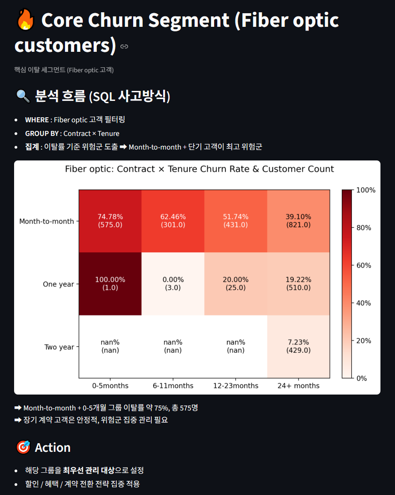
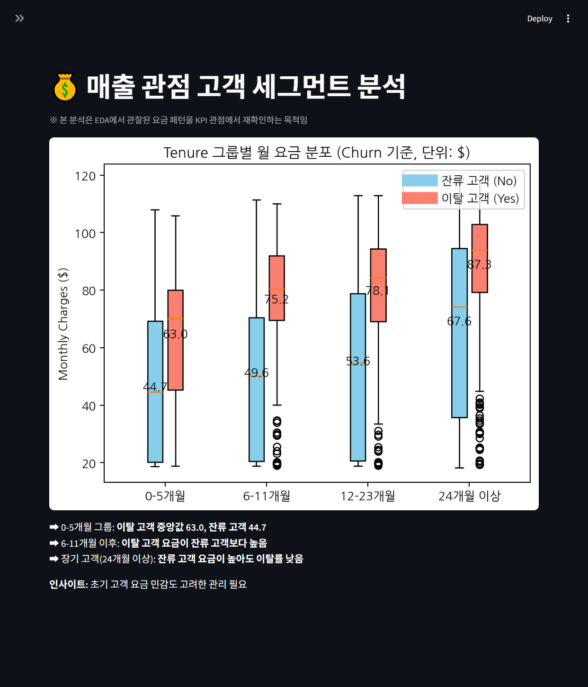
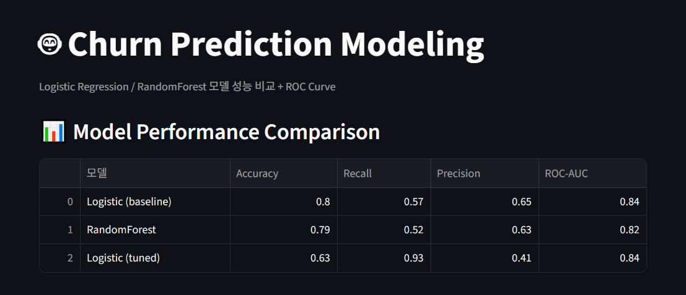
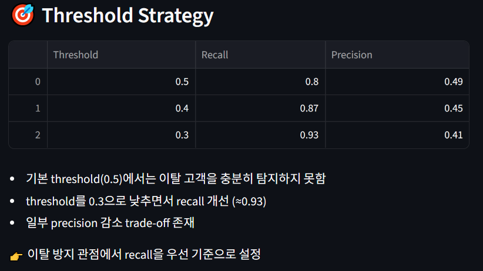
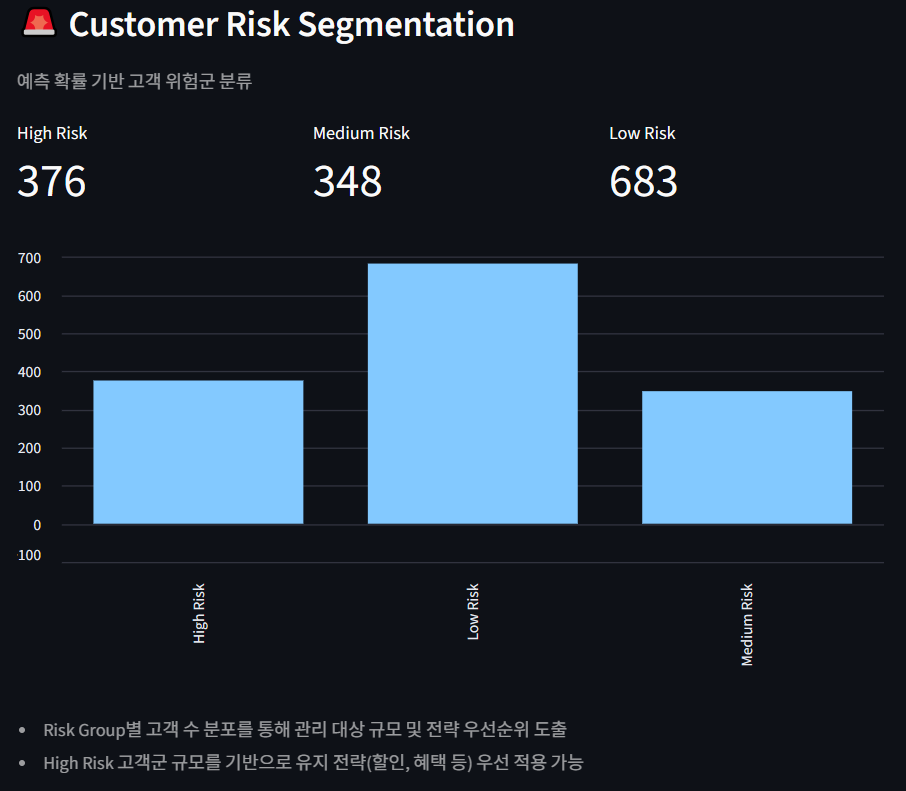
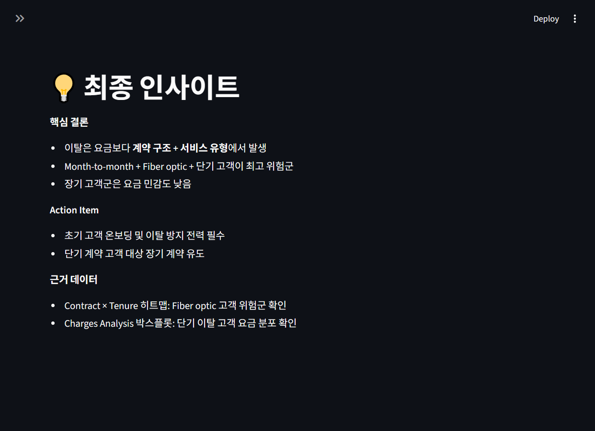

# Telco Customer Churn Analysis  
  
**SQL 기반 KPI 정의 → Python 재현 → Streamlit 자동화 리포트**  
  
📊 본 프로젝트는 Telco 고객 이탈 데이터를 활용하여,  
**EDA를 통한 가설 도출**, **운영 DB 기준 SQL KPI 정의·검증**,  
**머신러닝 모델링을 통한 이탈 고객 예측**,  
그리고 **Streamlit 기반 자동화 리포트 및 대시보드 구축**까지 포함하는  
**엔드투엔드 데이터 분석 프로젝트**입니다.  
  
📊 **Live Dashboard (Streamlit Cloud)**  
🔗 [Live Demo](https://mars-telco-churn-analysis.streamlit.app/)  
  
---  
  
## 프로젝트 구조
```text
churn_project/
├─ app/
│ └─ churn_sql_streamlit.py     # Streamlit 자동화 대시보드
├─ data/
│ ├─ cleaned_churn.csv          # EDA 전처리 완료 데이터
│ └─ telco_churn.csv            # 고정 데이터(CSV)
├─ notebooks/
│ ├─ pandas_eda.ipynb           # 탐색적 데이터 분석 (EDA)
│ ├─ sql_python_analysis.ipynb  # SQL + Python 기반 KPI 정의·검증
│ └─ modeling_churn.ipynb       # 머신러닝 모델링 및 성능 비교
├── screenshots/
│ └─ ...(주요 스크린샷 포함)
├─ .env                         # DB 접속 정보 (실무 환경)
├─ .gitignore
├─ README.md
└─ requirements.txt  
```
  
---  
  
## 1️⃣ 프로젝트 개요
  
### 🎯 목적
- 고객 이탈(Churn)에 영향을 미치는 **핵심 변수 및 고위험 세그먼트 식별**
- 탐색적 분석 결과를 **운영 DB 기준 KPI로 구조화·검증**
- 머신러닝 모델을 활용한 **이탈 예측 및 위험 고객 사전 탐지**
- **자동화된 리포트/대시보드**를 통한 의사결정 지원  
  
### 📂 데이터 기준
- **실무 가정**: MySQL 운영 DB
- **포트폴리오 구현**
  - 데이터 변동·권한·재현성 이슈를 고려하여 **CSV 기준 분석**
  - 모델링/대시보드 동일 데이터셋 사용 → **재현성 확보**
  - MySQL 연결 함수 및 SQL 쿼리는 코드 구현 → **실무 전환 가능 구조 유지**  
  
---  
  
## 2️⃣ 분석 흐름 (핵심 사고 구조)
```text
운영 DB / SQL  
      ↓  
EDA (가설 및 변수 식별)  
      ↓  
SQL 기반 KPI 재정의·검증  
      ↓  
Python 재현  
      ↓  
머신러닝 모델링 (이탈 예측)  
      ↓  
Streamlit 자동화 리포트
```
  
---  
  
## 3️⃣ 분석 단계 상세  
  
### 3-1. 탐색적 데이터 분석 (EDA)  
`notebooks/pandas_eda.ipynb`  
  
- 전체 고객 수, 이탈률, 클래스 불균형 확인
- 주요 변수 탐색
  - **Tenure**: 0–5개월 초기 고객 이탈률 높음
  - **Contract**: Month-to-month 계약 이탈률 높음
  - **InternetService**: Fiber optic 고객군 이탈 집중
  - **Charges**: 단기 + 고요금 구조에서 이탈 발생
- 변수 조합 기반 고위험 세그먼트 탐색
  - Fiber optic × Month-to-month × 0–5개월  
  
> 📌 EDA의 역할  
> 이탈 가능성이 높은 변수와 세그먼트를 **탐색적으로 식별**
  
---  
  
### 3-2. SQL + Python 기반 KPI 분석  
`notebooks/sql_python_analysis.ipynb`  
  
- **운영 DB 기준 KPI 정의**
  - 전체 고객 수 / 이탈 고객 수 / 이탈률
- **tenure_group KPI 기준 정의**
  - 0–5 / 6–11 / 12–23 / 24개월 이상
- SQL 집계 결과와 Pandas 재계산 결과 **정합성 검증**
- 핵심 KPI 세그먼트 도출
  - Fiber optic × Month-to-month × 0–5개월 → 최고 위험군  
  
> 📌 이 단계의 역할  
> EDA에서 도출된 가설을 **운영 DB 기준 KPI로 재정의·검증**  
  
---  
  
### 3-3. 머신러닝 모델링 (Churn Prediction)  
`notebooks/modeling_churn.ipynb`  
  
**🎯 문제 정의**  
- 고객 이탈 여부(Churn)를 예측하는 이진 분류 문제  
  
**🔧 모델 구성**  
- Logistic Regression (baseline)
- Random Forest
- Logistic Regression (class_weight + threshold tuning)  
  
**📊 주요 결과**  
| 모델                  | Accuracy | Recall | Precision | ROC-AUC |
| ------------------- | -------- | ------ | --------- | ------- |
| Logistic (baseline) | 0.80     | 0.57   | 0.65      | 0.83    |
| RandomForest        | 0.79     | 0.52   | 0.63      | 0.81    |
| Logistic (tuned)    | 0.63     | 0.93🔥 | 0.41      | 0.83    |  

**🔥 핵심 해석**  
- 기본 모델은 안정적인 정확도를 보였으나 **이탈 고객 탐지(recall) 부족**
- class_weight + threshold 조정을 통해  
  → **이탈 고객 탐지율 약 90% 이상으로 개선**  
- Precision 감소는 존재하지만, **비즈니스 관점에서는 recall이 더 중요**  
  
**🎯 최종 모델 전략**  
- Logistic Regression 선택
- threshold = 0.3 적용
- “이탈 고객을 놓치지 않는 것”을 최우선 기준으로 설정  
  
**💡 확장**  
- 예측 확률 기반 고객 위험군 분류
  - High / Medium / Low Risk segmentation  
  
> 📌 역할
> 단순 분석을 넘어 **이탈 가능 고객을 사전에 예측하는 구조 구현**
  
---  
  
### 3-4. Streamlit 자동화 대시보드  
`app/churn_sql_streamlit.py`  
  
**🔍 구현 전략**  
- **데이터 소스**  
  - 기본 실행: CSV 기반 (재현성·안정성 확보)
  - 실무 확장: MySQL 연결 함수 구현 (미호출 상태 & 확장 가능)
- **SQL 사고방식 기반 구성**
  - WHERE / GROUP BY / KPI 집계 흐름을 그대로 시각화  
- **분석 흐름 기반 UI 구성**
  - 계약 구조 → 서비스 패턴 → 이용 기간 → 위험군
  
**주요 기능**  
1. KPI Overview (전체 고객 수, 이탈률)
2. Contract / InternetService / Tenure 별 이탈률
3. 핵심 세그먼트 히트맵  
   (Contract × Tenure, Fiber optic 필터링)
4. Charges Analysis (월 요금 분포 비교)
5. 머신러닝 모델 성능 비교
6. ROC Curve 시각화
7. 인사이트 요약 및 Action Item
8. Appendix: SQL 쿼리 및 데이터 정합성 검증 결과  
  
> 📌 Streamlit의 역할  
> 분석 + 모델링 결과를 **의사결정 도구로 자동화**
  
---  

### 3-5. Streamlit 대시보드 스크린샷
아래는 CSV 기반 Streamlit 자동화 리포트 주요 화면입니다.  
  
**[Overview]**  
  
> 전체 KPI와 고객/이탈률 현황을 한눈에 확인  
  
**[Core Segment (히트맵)]**  
  
> Contract × Tenure × Fiber optic 기준 핵심 위험군 시각화, 위험 세그먼트 집중 확인   
  
**[Charges Analysis]**  
  
> Tenure 그룹별 잔류/이탈 고객 월 요금 분포(Boxplot) 비교  
  
**[Model Comparison]**  
  
> 모델별 성능 지표를 비교하여 최적 모델 선정 근거 제시  
  
**[Threshold Strategy]**  
  
> Threshold 조정을 통해 Recall-Precision trade-off를 비교하고, 이탈 탐지 기준을 비즈니스 관점에서 최적화  
  
**[Risk Segment]**  
  
> 이탈 확률 기반 고객을 Risk Group으로 분류하여 유지 전략 대상 및 우선순위 설정에 활용  
  
**[Insight]**  
  
> 분석 결과 기반 Action Item 요약 및 제안  
  
---  
  
## 4️⃣ 분석 결과 및 비즈니스 인사이트 
| 구분    | 인사이트                  | 액션               |
| ----- | --------------------- | ---------------- |
| 초기 고객 | 0–5개월 이탈 집중           | 온보딩 프로그램 강화      |
| 계약 유형 | Month-to-month 이탈률 높음 | 장기 계약 유도         |
| 서비스   | Fiber optic 고객군 위험    | 품질 개선 / 가격 전략 검토 |
| 요금    | 단기 고객 요금 민감           | 요금 구조 최적화        |
| 모델링   | 고위험 고객 사전 탐지 가능       | 타겟 마케팅 적용        |

  
---  
  
## 5️⃣ 기술 스택 및 실무 역량
  
### 🛠 사용 기술
- **Python**: Pandas, Scikit-learn, Matplotlib, Streamlit
- **SQL**: MySQL 기반 KPI 정의
- **ML**: Classification, ROC-AUC, Threshold tuning (이탈 고객 탐지 최적화)
- **IDE / Notebook**: VSCode + Jupyter Notebook 활용 개발 (코드/시각화 재현 가능)
- **OS / Environment**: **Linux 기반 개발 환경** (CLI 기반 실행 및 가상환경 분리 관리)
- **환경 관리**: dotenv 기반 설정 분리
  
### ⭐ 핵심 역량 
- Python 기반 데이터 분석 경험
- 데이터 분석을 통한 요금(매출) 관점 해석 경험
- SQL 기반 KPI 정의 및 검증 경험
- 머신러닝 모델 설계 및 성능 개선 (Recall 최적화)
- Streamlit 자동화 리포트 및 대시보드 구축
- 데이터 정합성 검증 및 분석 자동화 프로세스 구현  
  
---  
  
## 6️⃣ 실행 방법
  
### 6-1. 환경 설정
```bash
pip install -r requirements.txt
```
  
### 6-2. CSV 기준 실행
```bash
streamlit run app/churn_sql_streamlit.py
```
  
### 6-3. MySQL 기반 확장 (실무 가정)
- `.env` 파일에 DB 접속 정보 설정
- `load_data_from_mysql()` 함수 주석 해제 후 실행  
  
> 본 프로젝트는 **데이터 분석 → 머신러닝 → 서비스화 → 의사결정 연결**까지 수행하는
> 실무형 데이터 사이언스 프로젝트입니다. 

